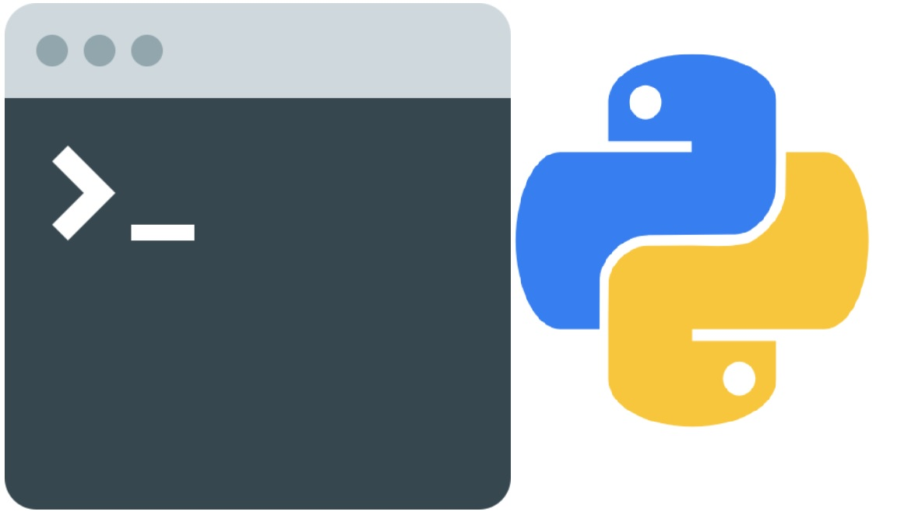

# CLI

CLI is a repository of command line interfaces to automate
geoprocessing tasks. It utilizes the argparse library
from the Python standard library to create the interface
between the users output that will be passed to the python
script to execute the geoprocessing

## Installation

There is no installation required, but you have to be aware
that there are certain packages that must be installed: 
	
* numpy 
* geopandas 
* pandas
* scipy 
* GDAL 
* rasterio 

## Usage

## Contributing
Pull requests are welcome. For major changes, please open an issue first to discuss what you would like to change.
Please make sure to update tests as appropriate.

## License
[MIT](https://choosealicense.com/licenses/mit/)
